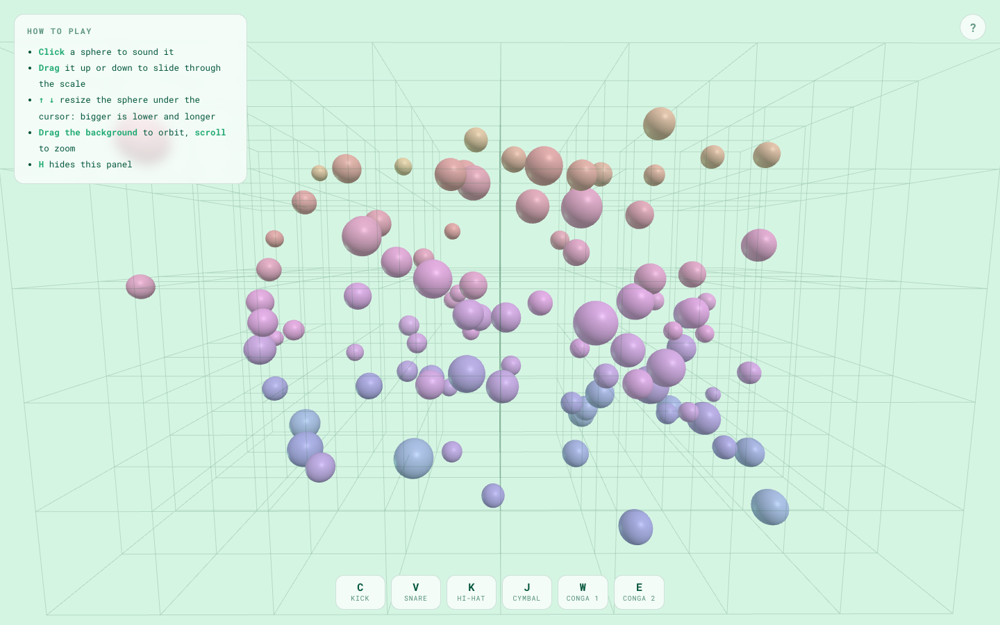

# Musical Circles

A 3D interactive musical world built with [three.js](https://threejs.org) and
[Tone.js](https://tonejs.github.io). A hundred spheres float inside a wireframe
cage, and each one is a note. Where a sphere sits in space is what it sounds
like, so playing the instrument means rearranging the world.



## How it plays

| Gesture | Result |
| --- | --- |
| Click a sphere | Sounds its note |
| Drag a sphere up or down | Slides through the scale, retriggering at each new note |
| `↑` / `↓` over a sphere | Resizes it: bigger is lower and longer |
| Drag the background | Orbits the camera |
| Scroll | Zooms |
| `C` `V` `K` `J` `W` `E` | Kick, snare, hi-hat, cymbal, conga 1, conga 2 |
| `H` | Hides the instructions panel |

Everything is tuned to a major pentatonic scale spanning five octaves, so there
is no wrong note no matter where things end up.

| Axis | Maps to |
| --- | --- |
| Height (Y) | Pitch, low at the floor and high at the ceiling |
| Width (X) | Stereo position |
| Depth (Z) | Loudness, nearer is louder |
| Size | Octave and note length |

Sphere colour tracks pitch, running blue through violet, pink and red up to
gold, so the scene doubles as a score you can read at a glance.

## Running it

Requires Node 22.12 or newer.

```bash
npm install
npm run dev        # http://localhost:3030
```

For a production build:

```bash
npm run build      # emits ./dist
npm start          # express serves ./dist on PORT (default 3031)
```

## Layout

| File | Purpose |
| --- | --- |
| `main.js` | Scene, camera, pointer and keyboard interaction, render loop |
| `audio.js` | Master signal chain, 16-voice pool, position-to-note mapping |
| `drums.js` | The six samples, their keys, and retrigger-safe playback |
| `server.js` | Static server for the production build |

## History

The original 2D prototype was made with p5.js and Tone.js:
https://editor.p5js.org/chrislee1/full/Pslb99qgX

An earlier version was deployed at `musical-circles.onrender.com`, which is no
longer responding.
